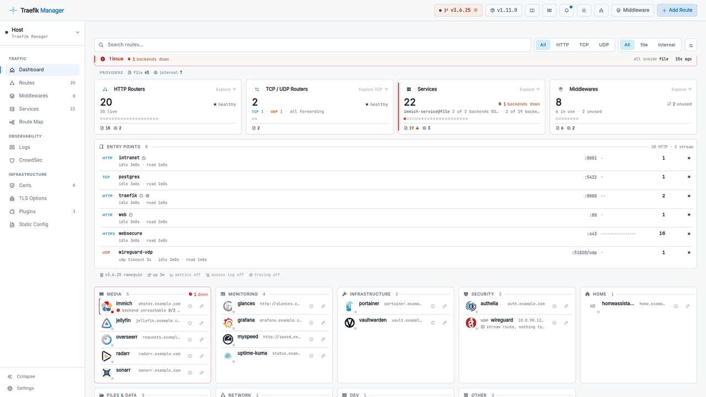

<div align="center">


# Traefik Manager

**A clean, self-hosted web UI for managing your Traefik reverse proxy.**

Add routes, manage middlewares, monitor services, and view TLS certificates - all without touching a YAML file by hand.

[](https://github.com/chr0nzz/traefik-manager/releases)
[](https://github.com/chr0nzz/traefik-manager/actions/workflows/docker.yml)
[](https://github.com/chr0nzz/traefik-manager/actions/workflows/tests.yml)
[](https://github.com/chr0nzz/traefik-manager/pkgs/container/traefik-manager)
[](https://github.com/chr0nzz/traefik-manager/commits/dev)
[](LICENSE)
[](https://traefik-manager.xyzlab.dev/)


[](https://github.com/chr0nzz/traefik-manager/stargazers)
[](https://github.com/chr0nzz/traefik-manager/issues)
[](https://github.com/chr0nzz/traefik-manager-mobile)
[](https://play.google.com/store/apps/details?id=dev.chr0nzz.traefikmanager)
[](https://play.google.com/store/apps/details?id=dev.chr0nzz.traefikmanager)
[](https://ko-fi.com/chr0nzz)

</div>
<div align="center">
<sub>Built for homelabbers who love Traefik but hate editing YAML at 2am.</sub>
</div>

---

## Highlights

- **New design** - full-width layout with a collapsible side navigation, redesigned cards, and slide-in editors throughout
- **Routes** - add, edit, clone, and enable/disable HTTP, TCP, and UDP routes from the browser
- **Load balancing** - multiple backends per route, sticky sessions, health checks, and router priority
- **Middlewares** - 24 guided wizards plus a raw YAML editor, for HTTP and TCP
- **Multi-server** - manage unlimited remote Traefik instances through a lightweight Go agent
- **Static config editor** - edit the full `traefik.yml` from the UI and apply it with a one-click Traefik restart
- **Backups** - timestamped local backups plus git push with history, diffs, and one-click restore
- **Monitoring** - live services, certificates, CVE advisory warnings, plus access logs and CrowdSec rebuilt as
  click-through analytics rather than raw lists
- **Searchable settings** - one box finds any setting by name, description, or current value, across every pane
- **Mobile app** - native Android companion app on Google Play

## Quick Start

**One-liner installer** - installs Traefik + Traefik Manager together, or Traefik Manager on its own via Docker or a native Linux service:

```bash
curl -fsSL https://get-traefik.xyzlab.dev | bash
```

**Manual Docker Compose:**

```yaml
services:
  traefik-manager:
    image: ghcr.io/chr0nzz/traefik-manager:latest
    container_name: traefik-manager
    restart: unless-stopped
    ports:
      - "5000:5000"
    environment:
      - COOKIE_SECURE=false
    volumes:
      - /path/to/traefik/dynamic.yml:/app/config/dynamic.yml
      - /path/to/traefik-manager/config:/app/config
      - /path/to/traefik-manager/backups:/app/backups
```

```bash
docker compose up -d
```

Open **http://your-server:5000** - the setup wizard will guide you through the rest.

---

## Screenshots

<p align="center">
<a href="https://traefik-manager.xyzlab.dev/ui-examples.html"><picture>
  <source media="(prefers-color-scheme: dark)" srcset="docs/public/images/readme-carousel-dark.gif">
  
</picture></a>
</p>

---

## Features

### Routes

- Add, edit, clone, delete, and enable/disable **HTTP, TCP, and UDP** routes
- **Multiple domains per route** with a chip builder, or switch to the **advanced rule editor** for complex expressions (`PathPrefix`, `HostRegexp`, `&&` / `||`)
- **Multiple backends per route** - point HTTP, TCP, or UDP at several servers and let Traefik load-balance across them; route cards show a `+N` badge
- **Sticky sessions, health checks, and router priority** - `loadBalancer.sticky.cookie`, `loadBalancer.healthCheck`, and `router.priority` as form fields instead of raw YAML
- **Guided route presets** - one-click **security headers** and **streaming** tuning for Jellyfin/Emby/Plex; the middlewares they generate stay visible and editable, and hand-written ones are never overwritten
- **Per-route certificate resolver** - pick any configured resolver, request **wildcard certificates**, or disable TLS
- **TLS options profiles** - create named `tls.options` (min/max version, ciphers, mTLS, SNI strict) and assign them per route
- **insecureSkipVerify per service** for backends with self-signed certs (Proxmox, Kasm, etc.)
- **Multi-config file support** - mount several dynamic files via `CONFIG_DIR` / `CONFIG_PATHS`, choose the target file per route, create new files from the UI
- Optional **app icons** on route cards and lists, shared with the Dashboard tab

### Middlewares

- **24 guided wizards**: Basic/Digest Auth, Forward Auth (with Authentik, Authelia, and Gatekeeper presets), OIDC Auth, Rate Limit, In-Flight Requests, IP Allowlist, Secure Headers, CORS, Redirects, Strip/Add/Replace Prefix, Retry, Circuit Breaker, Buffering, Compress, Chain, Encoded Characters, and more
- **Raw YAML editor** for anything the wizards don't cover
- **Custom templates** - manage your own reusable YAML from a slide-in panel in the middlewares toolbar, and start a new middleware from one in the Add form. Shared across every server
- **Client IP source selector** in the IP Allowlist wizard - match the real client instead of your proxy, via trusted hop depth (`ipStrategy.depth`) or excluded proxy IPs (`ipStrategy.excludedIPs`)
- **TCP middlewares** alongside HTTP
- **Provider middlewares** (Docker, Kubernetes, etc.) shown read-only in the provider tabs

### Live Dashboard & Monitoring

- Real-time stats: router counts, service health, entrypoints, Traefik version
- **Provider tabs**: Docker, Kubernetes, Swarm, Nomad, ECS, Consul Catalog, Redis, etcd, Consul KV, ZooKeeper, HTTP, File - all API-based, no extra mounts
- **Traefik CVE advisory warnings** - flags known security advisories affecting your running Traefik version
- Optional tabs (toggle in Settings) - API-based, no mounts:
  - **Dashboard** - routes grouped by category with app icons from [selfh.st/icons](https://selfh.st/icons/) (cached locally), per-card name/icon/group overrides
  - **Route Map** - entry points, routes, middlewares, and services in a visual topology
  - **TLS Options** - create and manage named `tls.options` profiles, assignable per route
  - **CrowdSec** - decisions and alerts from a LAPI; ban, captcha, bypass, or unban IPs with one click
- **Logs as analytics** - the access log becomes seven click-through cards (status codes, response time, methods, domains, paths, clients, services) with a "where it fails" panel naming the worst status-and-path pairs; every count is a filter, and an optional auto-refresh polls without losing your filters or scroll position
- **CrowdSec around the attack** - attacking sources, networks by ASN, scenarios, targeted paths, tooling by user agent, and bans in force; colour marks only what is *not* already handled, so a host being probed but absorbed cleanly reads calm. Authenticates with a bouncer key, machine login, or a client certificate for mTLS setups
- **IP geolocation** *(optional, off by default)* - country flags and a shaded, clickable **world map** of where your traffic and bans come from, on the Logs and CrowdSec tabs; lookups run on the server against a local [DB-IP](https://db-ip.com) database (no IPs leave your machine), or point `GEOIP_DB_PATH` at your own MaxMind `.mmdb`
- Optional tabs that read a mounted file:
  - **Certs** *(mount `acme.json`)* - TLS certificates with expiry tracking; accepts several storage files or a directory, one per cert resolver
  - **Plugins** *(mount `traefik.yml`)* - view plugins declared in your static config, and **install new ones** by pasting the snippet from the plugin catalog - TM writes the static config, optionally creates the matching middleware, and prompts a restart
  - **Logs** *(mount the Traefik access log)* - parsed access log cards with full-detail panel
- **Client IP Diagnostic** - a read-only tool in the top nav showing what this instance actually sees for your own request: the trusted client IP (the one that feeds the login and audit log, `ipAllowList`, and CrowdSec), the raw socket peer, the trusted proxy hop count, and the forwarding headers as received. Warns when the trusted IP is private, loopback, or CGNAT while you expect public clients
- **Source-IP classification** in the Logs tab - every IP in **Top IPs** is tagged **Public**, **Private**, **CGNAT**, **Loopback**, or **Link-local**, so local noise like a gateway's hairpin-NAT address is easy to tell apart from real traffic
- **Configurable file paths** - set the `acme.json`, access log, and static config paths from **Settings → File Paths** without a container restart; UI settings override env vars
- **Light, dark, or system theme** - the nav-bar toggle sets the default for the whole instance, including the login page
- Card/list view toggle on Routes, Middlewares, and Services
- **Typed confirmation for destructive actions** - deleting a route, a middleware, or a bulk selection asks for `DELETE`; restoring a backup or a git commit asks for `RESTORE`. Each says what is lost before it goes, and the word is click-to-copy
- **Settings search** - filter any pane by setting name, description, or current value, with match counts on the other panes so a setting can be found without knowing which pane holds it

### Static Config Editor *(optional - mount `traefik.yml` read-write)*

- Edit every part of `traefik.yml` from the UI - **Entrypoints, Cert Resolvers, Plugins, API, Logging, and Providers** sections, plus a raw **Monaco** YAML editor for the full file
- Changes are staged and backed up; apply them with a **one-click Traefik restart** - via socket proxy (recommended), poison pill (no socket needed), or direct socket
- Full-screen reconnect overlay polls until Traefik is back up
- **Show it where you want** - off, inside the Settings window, or as its own tab, grouped into Traffic in, Certificates and Operations with a verdict line naming anything that needs attention

### Backups

- **Timestamped backups** before every change, one-click restore, **configurable retention**
- **Git repository backup** - auto-push your config to GitHub, Gitea, Forgejo, GitLab, or any HTTPS remote; browse commit history, view side-by-side diffs, restore any commit, set custom commit messages
- **One repository for all servers** - agents can push to the Host's repository on their own branch, one branch per server (enforced), with per-agent history, diffs, and restore

### Multi-Server (Agents)

- **Traefik Manager Agent (TMA)** - a lightweight Go daemon that runs next to Traefik on any remote server
- **Server switcher** in the nav bar - every tab (routes, services, middlewares, backups, logs) works against the active server
- Setup wizard generates a ready-to-paste Docker Compose or Docker Run command; API key shown once and stored encrypted
- **Cert resolvers without mounting the static config** - resolvers already in use by that server's routes are detected from its Traefik API, merged with its static config when mounted, plus an optional per-agent override field
- **Git backup without agent-side setup** - enable *Use Host Repository* and the Host pushes that agent's config to its git repo on a dedicated branch; or run agents autonomously via `GIT_BACKUP_*` env vars
- Manage unlimited servers from one TM - no VPN or SSH required

### Notifications

- In-app notification center for logins, config saves, restarts, backups, and CrowdSec actions
- **Webhook forwarding** to Discord, Slack, ntfy, or any generic JSON endpoint, with a test button in Settings

### Security

- **bcrypt passwords** (cost 12), optional **TOTP 2FA**, session fixation protection, configurable inactivity timeout
- **OIDC / SSO** - Keycloak, Google, Authentik, or any OIDC provider; restrict by email or group; can run as the **sole login method** with built-in auth disabled
- **Per-device API keys** (up to 10, individually revocable) - the mobile app keeps working in every auth mode
- CSRF protection, rate limiting, SSRF and git-transport hardening, secrets encrypted at rest (Fernet), atomic config writes
- **Configurable trusted proxy hops** - `PROXY_FIX_HOPS` (default `1`) sets how many reverse-proxy hops to trust when reading `X-Forwarded-For`, so the login and audit log record the real client behind a chain like Cloudflare → Traefik → TM. Only count hops you actually control - each trusted hop is one more entry a client could forge
- See the [security](https://traefik-manager.xyzlab.dev/security.html) and [Traefik hardening](https://traefik-manager.xyzlab.dev/hardening.html) docs

---

## Deployment

| Runtime                                                                                                              | Guide                                                                                                                 |
| ----------------------------------------------------------------------------------------------------------------------| -----------------------------------------------------------------------------------------------------------------------|
|  Installer | [One-liner: full stack, TM-only Docker, TM-only Linux service, Agent](https://traefik-manager.xyzlab.dev/traefik-stack.html) |
|  Docker              | [Docker Compose setup, networking, behind Traefik](https://traefik-manager.xyzlab.dev/docker.html)                    |
|  Podman              | [Rootless, Quadlet/systemd, SELinux labels](https://traefik-manager.xyzlab.dev/podman.html)                           |
|  Linux                | [Native Python + systemd, no container required](https://traefik-manager.xyzlab.dev/linux.html)                       |
|  Unraid              | [Community Applications template, networking, multi-config](https://traefik-manager.xyzlab.dev/unraid.html)           |
| <i>Agent</i>                                                                                                         | [TMA - remote agent for multi-server management](https://traefik-manager.xyzlab.dev/agent.html)                       |

---

## Documentation

Full documentation at **[traefik-manager.xyzlab.dev](https://traefik-manager.xyzlab.dev/)**

|                                                                           |                                                       |
| ---------------------------------------------------------------------------| -------------------------------------------------------|
| [Get Started](https://traefik-manager.xyzlab.dev/guide.html)              | Deployment guides for Docker, Podman, and Linux       |
| [Traefik Stack](https://traefik-manager.xyzlab.dev/traefik-stack.html)    | One-liner installer guide                             |
| [Configuration](https://traefik-manager.xyzlab.dev/manager-yml.html)      | `manager.yml` reference                               |
| [Environment Variables](https://traefik-manager.xyzlab.dev/env-vars.html) | `CONFIG_DIR`, `CONFIG_PATHS`, auth, domains, and more |
| [Security](https://traefik-manager.xyzlab.dev/security.html)              | API keys, sessions, CSRF, rate limits, and hardening  |
| [Traefik Hardening](https://traefik-manager.xyzlab.dev/hardening.html)    | CVE advisories, header aliases, forwardAuth limits    |
| [API Reference](https://traefik-manager.xyzlab.dev/api.html)              | REST API for integrations and the mobile app          |
| [Agent API](https://traefik-manager.xyzlab.dev/api-agent.html)            | TMA endpoints, auth, and health checks                |
| [Static Config Editor](https://traefik-manager.xyzlab.dev/static.html)    | Entrypoints, cert resolvers, and the restart flow     |
| [Enable Static Config](https://traefik-manager.xyzlab.dev/static-enable.html) | Turn it on for an existing install, without re-running setup |
| [IP Geolocation](https://traefik-manager.xyzlab.dev/geoip.html)           | Country flags, world map, and bring-your-own database |
| [Notification Webhooks](https://traefik-manager.xyzlab.dev/webhooks.html) | Discord, Slack, ntfy, and generic JSON payloads       |
| [OIDC / SSO](https://traefik-manager.xyzlab.dev/oidc.html)                | OIDC setup, provider examples, and access control     |
| [Git Repository Backup](https://traefik-manager.xyzlab.dev/git-backup.html) | Auto-push, commit history, diff viewer, and one-click restore |
| [Mobile App](https://traefik-manager.xyzlab.dev/mobile.html)              | Android companion app setup and features              |
| [Reset Password](https://traefik-manager.xyzlab.dev/reset-password.html)  | CLI reset, TOTP recovery, manual reset                |
| [Beta Program](https://traefik-manager.xyzlab.dev/beta.html)              | Run the `:beta` image and test changes before release |
| [UI Examples](https://traefik-manager.xyzlab.dev/ui-examples.html)        | Screenshots and walkthroughs                          |
| [Provider Tabs](https://traefik-manager.xyzlab.dev/tab-docker.html)       | Docker, Kubernetes, Swarm, Nomad, ECS, and more       |

---

## Mobile App

**traefik-manager-mobile** is a native Android companion app for managing Traefik Manager from your phone. Version 2.0 is a ground-up rewrite in Kotlin and Jetpack Compose. Requires **Traefik Manager v1.10.1 or higher**.

|          |                                                                                                |
| ----------| ------------------------------------------------------------------------------------------------|
| Repo     | [github.com/chr0nzz/traefik-manager-mobile](https://github.com/chr0nzz/traefik-manager-mobile) |
| Download | [Latest release](https://github.com/chr0nzz/traefik-manager-mobile/releases/latest)            |
| Auth     | Per-device API key - generate one in **Settings → Authentication → App / Mobile API Keys**     |

<a href="https://play.google.com/store/apps/details?id=dev.chr0nzz.traefikmanager">
  
</a>

Features: the signal desk on Home · routes, middlewares and services with guided wizards and raw YAML · live log tail with analytics · the full CrowdSec desk with a world map · certificates and plugins · local and Git backups with restore · multi-server switching between the host and every agent · configurable home screen widgets · biometric app lock · system light/dark theme.

---

## Tech Stack

| Layer     | Technology                                    |
| -----------| -----------------------------------------------|
| Backend   | Python 3.11 · Flask 3.1 · Gunicorn            |
| Agent     | Go 1.25 · Alpine Linux (TMA - remote agent daemon) |
| Config    | ruamel.yaml (preserves comments and Go templates) |
| Auth      | bcrypt · pyotp (TOTP) · Flask sessions · CSRF · Flask-Limiter · Fernet |
| Frontend  | Vanilla JS · Tailwind CSS 3.4 · Phosphor Icons |
| Editor    | Monaco Editor 0.52 (VS Code engine)           |
| Route Map | dagre 0.8 (graph layout)                      |
| Geolocation | maxminddb · DB-IP Lite (local lookups, no external calls) |
| Tests     | pytest · ruff · `go test` - run on every pull request |
| Container | Docker · Alpine Linux · all JS/CSS dependencies bundled at build time (no CDN at runtime) |

---

## Contributing

Pull requests are welcome. See [CONTRIBUTING.md](CONTRIBUTING.md) for how to report bugs, suggest features, and run the project locally.

## Contributors

Traefik Manager is better because of the people who took the time to dig into it and send patches. Thank you.

<p align="center">
<a href="https://github.com/fbnlrz" title="Fabi (@fbnlrz) - client-IP feature set, guided route presets, config-safety fixes"></a>
<a href="https://github.com/adrianrp1988" title="Adrian Rodriguez (@adrianrp1988) - TCP middlewares on TCP routes"></a>
<a href="https://github.com/akanealw" title="@akanealw - Authelia forward-auth template fix"></a>
<a href="https://github.com/maca134" title="@maca134 - horizontally resizable modals"></a>
</p>

Thanks as well to everyone who has opened an issue or a discussion. Several features started as a question from someone running into something unexpected, and the detail in those reports is what made them fixable.

## License

[GPL-3.0](LICENSE)
